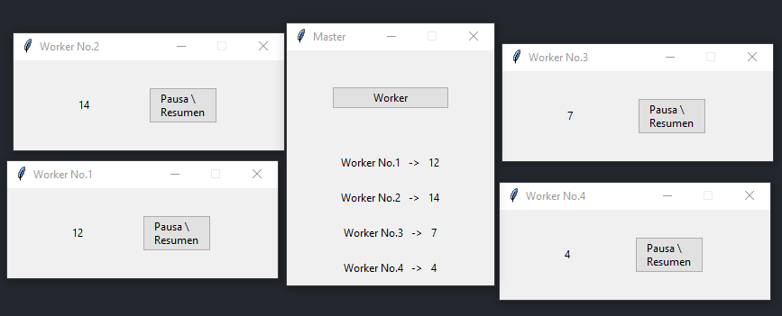

# Test_Bernardo
### El programa es un ejemplo de todos los desafios de la prueba:  
* Paralelismo
* Concurrencia
* Asincronismo
* Workerpool
* Semáforo
## 1. Ejecución
### Solo es necesaria la ejecución del ***main.py***
* El programa no utiliza librerias externas. Por lo que no es necesaria la creación de un entorno virtual.  

## 2. Funcionamiento
#### 2.1 Primera vista
Al iniciar el programa se mostrará la siguiente ventana.  

#### 2.2 Ejecución del primer worker 
Al presionar el boton *workers* se creara un *worker* el cual, es una ventana corriendo independientemente un proceso, un conteo cíclico simple del 1 al 20. Como se podra notar, el conteo que se muestra en el *worker* tambien se ve reflejado en el proceso principal, indicado por su identificador (número de worker) que se muestra tambien en el título de la ventana *worker*.

Cada ventana *worker* tendrá dentro un botón con el que se podrá pausar y reanudar el conteo.

  

#### 2.3 Ejecución de múltiples workers
Se puede presionar cuantas veces se quiera hacerlo, al botón *Worker*, el proceso principal (ventana inicial) es la encargada de gestionar los diferentes procesos.  

  

Al abrir un nuevo *worker* éste traera consigo un nuevo proceso (conteo ciclico del 1 al 20) que se podrá visualizar también dentro del proceso principal, así como su respectivo botón para pausar y reanudar el conteo.

#### 2.4 Espera de los conteos y eliminación de workers
Los conteos de los *workers* funcionan de tal forma que, cuando el conteo de un *worker* llega a 20 se detiene (sin afectar los demás procesos) y esperará a reiniciarse hasta que todos los workers existentes lleguen al 20 también.  
El termino "existente" en este contexto es muy importante, ya que, si se cierra una ventana worker su proceso deja de existir completamente, su conteo ya no sera tomado en cuenta por los demás workers y por lo tanto ya no lo esperarán para reiniciarse. Además, su conteo dejará de verse relfejado en la ventana principal.

#### 2.5 Lista de espera de workers para ser creados
Como se mencionó anteriormente, el boton **Worker** se puede presionar tantas veces se desee, pero esto no significa que se crearán inmediatamente los procesos workers. Al llegar a un limite de 4 workers vivos al mismo tiempo, si se sigue presionando el botón **Worker**, lo que pasará es que se creará una cola de workers que esperarán para ser creados. Mientras se siga presionando el botón **Worker** aumentará la lista de workers a ser creados.  

  

Para que un worker en espera pueda ser creado, se deberá cerrar un proceso worker vivo, al hacerlo, inmediatamente se creará un worker que estaba en la lista de espera y se descenderá el número de workers en espera a ser creados.

Al iniciarse la lista de espera, se podrá ver su estado en el proceso principal, asi como también se creará un botón con el cual se podra eliminar la lista de espera de workers a ser creados.

#### 2.6 Finalización del programa
Para detener la ejecución del programa basta con cerrar el proceso principal (ventana principal), si hay workers vivos estos se cerrarán automaticamente también.

